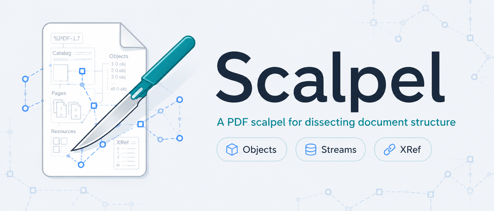

# Scalpel



Scalpel is a native PDF debugger for dissecting document structure. It is built
with Rust, egui, and MuPDF, and is focused on read-only inspection of complex,
damaged, or surprising PDFs.

Scalpel is not a PDF editor and not a general-purpose reader. Its job is to
connect what you see on the rendered page with the low-level PDF objects behind
it: object trees, streams, xref entries, resources, page content, images, and
diagnostics.

> Internal crate and binary names still use `pdbg-*` while the user-facing
> product name is being migrated to Scalpel.

## Status

Scalpel is an early desktop preview. The app is already useful for inspecting
local PDFs, but APIs, package names, and UI details may still change before a
stable release.

Current release workflow builds packaged Scalpel desktop archives for macOS,
Linux, and Windows.

## Features

- Open local PDFs with MuPDF.
- Prompt for a password when an encrypted PDF requires one.
- Render page previews with zoom, rotation, page navigation, and bounded output
  limits.
- Inspect the document tree: trailer, catalog, page tree, xref objects, indirect
  references, page resources, content streams, and XObjects.
- Inspect objects as dictionaries, arrays, names, strings, scalars, indirect
  references, pages, streams, and xref entries.
- View streams as formatted operators or raw bytes.
- Dedicated Hex tab with offset jump, raw/decoded mode, windowed paging, and
  aligned ASCII output.
- Xref tab for cross-reference entries.
- Diagnostics tab for parser, render, stream, password, and repair diagnostics.
- Search objects and page text with bounded lazy loading.
- Correlate page preview selections with content stream spans.
- Highlight text, images, vector bounds, and related stream operations when
  available.
- Open content-stream XObjects from the formatted stream view.
- Preview image XObjects and export stream bytes.
- Export raw or decoded streams without being limited by the visible stream
  window.
- Dark/light theme, persistent UI settings, recent files, and safe-mode status.

## Screenshots And Branding

Logo and brand notes live in [`docs/brand-logo.md`](docs/brand-logo.md).

Primary assets:

- [`docs/ui/scalpel-logo.png`](docs/ui/scalpel-logo.png): current full logo
  and README banner.
- [`docs/ui/scalpel-mark.png`](docs/ui/scalpel-mark.png): current app icon
  mark reference.

The generated source images are kept in `docs/ui/` for now. They can be
normalized or replaced by final vector/icon assets once the brand direction is
locked.

## Quick Start

### From A Release Package

Download the archive for your platform from GitHub Releases, unpack it, and run
Scalpel.

```sh
# macOS: open Scalpel.app
# Linux: ./scalpel
# Windows: Scalpel.exe
```

If no PDF is provided, Scalpel starts empty and you can use **Open PDF...** from
the toolbar.

### From Source

Install Rust, prepare MuPDF, then run the GUI:

```sh
sh scripts/setup-mupdf.sh
. third_party/mupdf.env
cargo run -p pdbg-app -- --gui --pdf /path/to/file.pdf
```

Build a release binary:

```sh
sh scripts/setup-mupdf.sh
. third_party/mupdf.env
cargo build --release -p pdbg-app
./target/release/pdbg-app --gui --pdf /path/to/file.pdf
```

Increase the render dimension limit for very large pages:

```sh
./target/release/pdbg-app --gui --pdf /path/to/file.pdf --render-max-dimension 8192
```

The same option is also accepted as `--max-render-dimension`.

## MuPDF Setup

The default real desktop build links against MuPDF. This repository does not
commit downloaded MuPDF archives, extracted source trees, static libraries, or
local build outputs.

`scripts/setup-mupdf.sh` downloads and verifies the pinned MuPDF source archive,
extracts it under `third_party/`, builds the release static libraries, and
writes `third_party/mupdf.env`.

Pinned version:

```text
MuPDF 1.27.2
```

Useful environment overrides:

- `PDBG_MUPDF_CACHE_DIR`: where the MuPDF source archive is cached.
- `PDBG_MUPDF_SOURCE_DIR`: where the MuPDF source tree is extracted.
- `PDBG_MUPDF_ENV_FILE`: where the generated environment file is written.
- `PDBG_MUPDF_SKIP_BUILD=1`: skip building MuPDF when libraries already exist.

If setup fails with missing headers or libraries, remove the extracted source
tree and rerun:

```sh
rm -rf third_party/mupdf-1.27.2-source
sh scripts/setup-mupdf.sh
```

On Linux, install the GUI build dependencies used by CI:

```sh
sudo apt-get update
sudo apt-get install -y \
  build-essential \
  clang \
  libasound2-dev \
  libfontconfig1-dev \
  libgl1-mesa-dev \
  libwayland-dev \
  libx11-dev \
  libx11-xcb-dev \
  libxcb-render0-dev \
  libxcb-shape0-dev \
  libxcb-xfixes0-dev \
  libxi-dev \
  libxkbcommon-dev \
  pkg-config
```

On macOS, install the Xcode command line tools if `make`, `clang`, or the system
SDK are missing:

```sh
xcode-select --install
```

## Command Line

The app binary supports a small set of developer-oriented flags:

```text
pdbg-app [--gui] [--pdf <path>] [--gui-smoke-ms <ms>] [--render-max-dimension <px>]
```

Options:

- `--gui`: start the egui desktop app.
- `--pdf <path>`: open a PDF at startup.
- `--gui-smoke-ms <ms>`: start the GUI and exit after a delay; used by smoke
  tests.
- `--render-max-dimension <px>`: cap rendered page width/height.
- `--max-render-dimension <px>`: alias for `--render-max-dimension`.

Without `--gui`, the binary runs a headless smoke path and prints the opened
file summary.

## Development

Run the local fake-backend gate:

```sh
sh scripts/run_m0_local_gate.sh
```

Run real MuPDF tests after preparing MuPDF:

```sh
sh scripts/setup-mupdf.sh
. third_party/mupdf.env
cargo test -p pdbg-core --no-default-features --features real-mupdf
cargo test -p pdbg-app
```

Run the GUI smoke path:

```sh
. third_party/mupdf.env
cargo run -p pdbg-app -- --gui --gui-smoke-ms 1000 --pdf /path/to/file.pdf
```

Notes:

- The fake backend is used for fast contract tests and deterministic CI checks.
- The real MuPDF path is the production/debugger path.
- Some workspace-wide Cargo commands can unintentionally unify features across
  crates. Prefer package-scoped commands when testing fake and real backends
  separately.

## Repository Layout

```text
crates/pdbg-app             desktop GUI and binary entry point
crates/pdbg-core            safe Rust document/session model
crates/pdbg-shim            C FFI boundary and MuPDF adapter
crates/pdbg-contract-tests  backend contract tests
crates/pdbg-mcp             read-only MCP-facing library work
docs/                       architecture, plans, compliance, branding
fixtures/                   test PDFs and fixture notes
scripts/                    setup, CI, fuzz, notice, and ABI helper scripts
third_party/                MuPDF metadata/cache/source setup area
```

## Architecture

Scalpel keeps MuPDF pointers behind a C shim. The GUI and Rust application
layers use stable IDs and DTOs instead of holding MuPDF internals directly.

```text
egui desktop UI
  -> Rust application/session layer
  -> C shim boundary
  -> MuPDF C core
```

The app is read-only by design. Editing, rewriting, redaction, and save-overwrite
workflows are intentionally out of scope for the current preview.

More detail: [`docs/pdf-debugger-architecture.md`](docs/pdf-debugger-architecture.md).

## Releases

GitHub Actions publishes release archives when a tag matching `v*` is pushed, or
when `.github/workflows/release.yml` is run manually with a tag.

Current packaged platforms:

- macOS: `Scalpel-<tag>-macos-<arch>.app.zip`
- Linux: `Scalpel-<tag>-linux-<arch>.tar.gz`
- Windows: `Scalpel-<tag>-windows-x64.zip`

Each archive includes:

- Scalpel desktop app or executable
- `README.md`
- `LICENSE`
- `NOTICES`
- SHA-256 checksum file next to the archive

The workflow builds MuPDF from the pinned source archive before building the app.

## License And Source Offer

This repository is licensed under `AGPL-3.0-only`.

Distributed binaries, packages, or hosted network services that link or bundle
the MuPDF build must provide corresponding source for the exact artifact users
receive or interact with. See
[`docs/compliance/agpl-source-offer.md`](docs/compliance/agpl-source-offer.md).

Third-party notices are tracked in [`NOTICES`](NOTICES).
